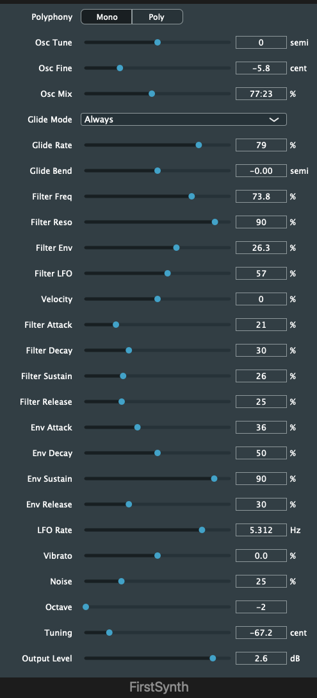
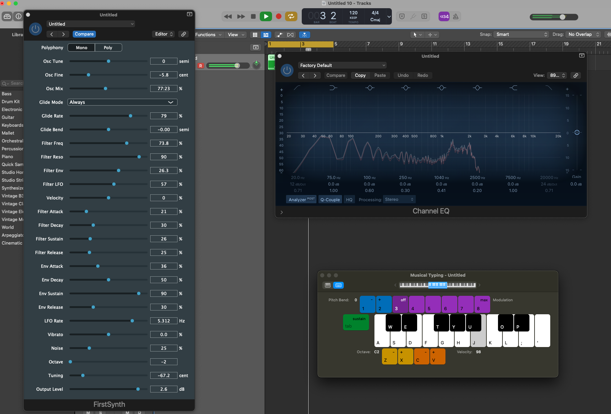

# FirstSynth

## Introduction

FirstSynth is a VST synthesizer plugin written in C++ using the JUCE framework. It is a simple subtractive synthesizer with a single oscillator, a filter, an envelope, an LFO, and a noise generator. The plugin can be used to create a variety of sounds, from basses and leads to pads and effects.

## Features

- Oscillator with pitch and fine tuning controls
- Selectable glide modes (always, legato, portamento)
- Filter with cutoff frequency, resonance, and envelope modulation
- LFO with rate and depth controls
- Noise generator
- Octave and tuning controls
- Output level control

## Getting Started

1. Clone the repository to your local machine.
1. Open the project in a C++ IDE that supports JUCE.
1. Build and run the plugin.

## Usage

FirstSynth can be used in any DAW that supports VST plugins. Once the plugin is loaded, you can adjust the settings to create the desired sound. The plugin's parameters are described in more detail below.

## Parameters

- **Polyphony**: This setting determines how many notes the plugin can play simultaneously. Mono means that only one note can be played at a time, while Poly means that multiple notes can be played at the same time.

* **Osc Tune**: This setting controls the pitch of the oscillator.
* **Osc Fine**: This setting controls the fine tuning of the oscillator.
* **Osc Mix**: This setting controls the mix between the sine and sawtooth waveforms of the oscillator.
* **Glide Mode**: This setting determines how the pitch glides between notes.
* **Glide Rate**: This setting controls the speed of the glide effect.
* **Glide Bend**: This setting controls the amount of pitch bend applied to the oscillator.
* **Filter Freq**: This setting controls the cutoff frequency of the filter.
* **Filter Reso**: This setting controls the resonance of the filter.
* **Filter Env**: This setting controls the amount of envelope modulation applied to the filter cutoff frequency.
* **Filter LFO**: This setting controls the amount of LFO modulation applied to the filter cutoff frequency.
* **Velocity**: This setting controls the velocity sensitivity of the filter.
* **Filter Attack**: This setting controls the attack time of the filter envelope.
* **Filter Decay**: This setting controls the decay time of the filter envelope.
* **Filter Sustain**: This setting controls the sustain level of the filter envelope.
* **Filter Release**: This setting controls the release time of the filter envelope.
* **Env Attack**: This setting controls the attack time of the amplitude envelope.
* **Env Decay**: This setting controls the decay time of the amplitude envelope.
* **Env Sustain**: This setting controls the sustain level of the amplitude envelope.
* **Env Release**: This setting controls the release time of the amplitude envelope.
* **LFO Rate**: This setting controls the rate of the LFO.
* **Vibrato**: This setting controls the amount of vibrato applied to the oscillator pitch.
* **Noise**: This setting controls the level of the noise generator.
* **Octave**: This setting controls the octave of the oscillator.
* **Tuning**: This setting controls the overall tuning of the plugin.
* **Output Level**: This setting controls the output level of the plugin.

## Screenshots

|         Plugin         | Logic Pro with Plugin  |
| :--------------------: | :--------------------: |
|  |  |
